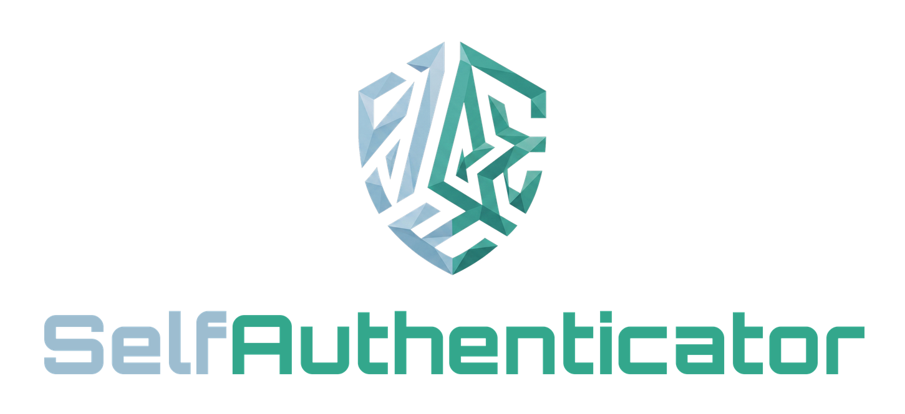

<div align="center">




**Self-hosted, zero-knowledge 2FA / TOTP vault — your own alternative to Synology Secure SignIn, Authy & Co.**

[](https://github.com/s3lfcod3r/selfauthenticator/actions/workflows/docker.yml)


[English](#english) · [Deutsch](#deutsch)

</div>

---

<a id="english"></a>

## 🇬🇧 English

A single Docker container that runs a **2FA / TOTP vault** — the web UI **and** the API behind it. Your TOTP secrets are stored **end-to-end encrypted**; the server only ever sees ciphertext.

Part of the **Self** family (SelfMailer, SelfArchiver, SelfDashboard …) — same design system, same deploy style (GHCR → Unraid).

### ✨ Features

- 🔐 **Zero-knowledge** — secrets are encrypted on your device; the server can never read them
- 🌐 **Web UI (PWA)** — installable, works in any browser
- 🔄 **Multi-device sync** — encrypted, with per-entry revisions
- 💾 **Encrypted backup / restore** — password-protected file, portable across devices
- 🐳 **Single container** — FastAPI + SQLite, no external database
- 🎨 **On-brand** — Self design system, dark by default
- 📱 **Native Android app** — _planned_ (Kotlin + Compose, biometric unlock, native QR scanner)

### 🛡️ Security model (zero-knowledge)

The server **never** stores plaintext. All TOTP seeds are encrypted/decrypted **only** on the client (browser).

```
Master password ──Argon2id──► MasterKey   (never leaves your device)
                                  │
                                  ├─ AuthHash = BLAKE2b(MasterKey‖pw) ──► Server (login proof only)
                                  │
                                  └─ decrypts ProtectedVaultKey ──► VaultKey
                                                                       │
                     TOTP seeds ──XChaCha20-Poly1305(VaultKey)──► Server (ciphertext only)
```

- **Argon2id** (64 MiB / 3 iterations) derives the MasterKey
- **XChaCha20-Poly1305** encrypts the VaultKey and every entry (192-bit nonce)
- The server only knows: e-mail, public KDF salt, an Argon2 hash of the AuthHash, and opaque ciphertext blobs → **DB theft yields garbage**
- ⚠️ The master password **cannot** be reset. Forget it = your codes are irreversibly encrypted.

**Hardening (v2.0.9):** rate limiting on login/register, hard-pinned JWT algorithms, server-side KDF minimums, security headers + CSP, ciphertext/ID size limits. Reviewed with the ECC security reviewer.

**Hardening (v2.2.0):** full line-by-line review of the container. Added: session logout with **server-side JWT revocation** (blocklist), **constant-time login** (no account-enumeration via timing), rate-limited vault endpoints + per-user entry cap, key separation, **non-root container**, `Permissions-Policy`, in-memory key zeroing.

### 🔒 Remote access

The container speaks plain **HTTP** and is meant to live on a trusted network. Pick what fits:

- **LAN only** — reach it at `http://<host>:8091` from inside your network.
- **VPN (recommended for personal use)** — expose nothing publicly; reach the LAN address through WireGuard / Tailscale. The tunnel already encrypts everything end-to-end, so plain HTTP is fine.
- **HTTPS reverse proxy** — for public exposure without a VPN; see the **[HTTPS guide](docs/HTTPS.md)**. Also required if you want the **web** camera/clipboard (browser secure-context).

### 🚀 Quick start (Docker)

```bash
cp .env.example .env
# generate a secret and put it in .env:
python -c "import secrets; print(secrets.token_hex(32))"

docker compose up -d
```

Open `http://<host>:8091` → create the first account → then set `SELFAUTH_ALLOW_REGISTRATION=false` and restart to close the server.

### 📦 Unraid

Add the template from
`https://raw.githubusercontent.com/s3lfcod3r/selfauthenticator/main/unraid/selfauthenticator.xml`
or import it in *Docker → Add Container → Template*. Set the **Master Secret**, leave the rest on defaults.

### ⚙️ Configuration (ENV, prefix `SELFAUTH_`)

| Variable | Required | Default | Purpose |
|---|---|---|---|
| `SELFAUTH_SECRET` | ✅ | – | Signs JWTs + anti-enumeration salt (≥ 32 chars) |
| `SELFAUTH_ALLOW_REGISTRATION` | – | `true` | Allow self-registration |
| `SELFAUTH_DB_PATH` | – | `/data/selfauthenticator.db` | SQLite path |
| `PORT` | – | `8091` | Host port |

### 📱 Android app (planned)

A native Android authenticator is on the roadmap — **not yet shipped** (no APK in this repo). The planned design:

- Talks **directly** to the same API — no embedded web view
- **Same libsodium crypto** as the web → the same account/vault works everywhere
- **Fingerprint unlock**, **native CameraX + ML Kit QR scanner**, native clipboard
- Server URL entered on first launch

For now, use the **Web UI (PWA)** — it is installable and works in any browser.

### 🔌 API contract

All crypto happens client-side; the API only exchanges blobs.

| Method | Path | Purpose |
|---|---|---|
| `GET` | `/api/auth/state` | `{has_users, allow_registration}` |
| `POST` | `/api/auth/prelogin` | `{email}` → KDF salt + parameters |
| `POST` | `/api/auth/register` | create account → JWT + protected_vault_key |
| `POST` | `/api/auth/login` | verify AuthHash → JWT + protected_vault_key |
| `POST` | `/api/auth/logout` | revoke the current JWT (server-side blocklist) |
| `GET` | `/api/auth/me` | current user |
| `GET` | `/api/vault` | all (encrypted) entries incl. tombstones |
| `POST` | `/api/vault` | create/update entry (optimistic concurrency) |
| `DELETE` | `/api/vault/{id}` | delete (tombstone) |

Entry plaintext (client only): `{issuer, label, secret, algorithm, digits, period}`.

### 🧱 Tech stack

| Part | Tech |
|---|---|
| Backend | FastAPI · SQLModel · SQLite · slowapi |
| Crypto | Argon2id · XChaCha20-Poly1305 (libsodium) |
| Web | React · Vite · PWA · libsodium-wrappers |
| App _(planned)_ | Kotlin · Jetpack Compose · lazysodium · CameraX · ML Kit |
| Deploy | Docker (multi-stage) · GHCR · Unraid |

### 🛠️ Development

```bash
# Backend
cd backend && pip install -r requirements.txt
export SELFAUTH_SECRET=$(python -c "import secrets; print(secrets.token_hex(32))")
uvicorn app.main:app --reload --port 8091

# Web (second terminal)
cd frontend && npm install && npm run dev   # http://localhost:5173, proxies /api → :8091
```

### 🗺️ Roadmap

- [x] **[HTTPS guide](docs/HTTPS.md)** (reverse proxy) → unlocks web camera + TWA
- [x] **Encrypted export / backup** (password-protected, portable)
- [ ] **Native Android app** (Kotlin + Compose, biometric unlock, native QR scanner)
- [ ] Bulk import (Google Authenticator `otpauth-migration://`)
- [ ] Optional passwords (vault schema is already generic)
- [ ] Tests toward 80 % coverage

---

<a id="deutsch"></a>

## 🇩🇪 Deutsch

Ein einzelner Docker-Container betreibt einen **2FA-/TOTP-Tresor** — die Web-Oberfläche **und** die API dahinter. Deine TOTP-Geheimnisse liegen **Ende-zu-Ende verschlüsselt**; der Server sieht ausschließlich Ciphertext.

Teil der **Self**-Reihe (SelfMailer, SelfArchiver, SelfDashboard …) — gleiches Design-System, gleicher Deploy-Stil (GHCR → Unraid).

### ✨ Funktionen

- 🔐 **Zero-Knowledge** — Geheimnisse werden auf deinem Gerät verschlüsselt; der Server kann sie nie lesen
- 🌐 **Web-Oberfläche (PWA)** — installierbar, läuft in jedem Browser
- 🔄 **Mehrgeräte-Sync** — verschlüsselt, mit Revision pro Eintrag
- 💾 **Verschlüsseltes Backup / Wiederherstellen** — passwortgeschützte Datei, geräteübergreifend austauschbar
- 🐳 **Ein Container** — FastAPI + SQLite, keine externe Datenbank
- 🎨 **Markentreu** — Self-Design-System, dunkel als Standard
- 📱 **Native Android-App** — _geplant_ (Kotlin + Compose, Biometrie-Entsperrung, nativer QR-Scanner)

### 🛡️ Sicherheitsmodell (Zero-Knowledge)

Der Server speichert **niemals** Klartext. Alle TOTP-Seeds werden **ausschließlich** im Client (Browser) ver- und entschlüsselt.

```
Master-Passwort ──Argon2id──► MasterKey   (verlässt das Gerät nie)
                                  │
                                  ├─ AuthHash = BLAKE2b(MasterKey‖pw) ──► Server (nur Login-Beweis)
                                  │
                                  └─ entschlüsselt ProtectedVaultKey ──► VaultKey
                                                                           │
                     TOTP-Seeds ──XChaCha20-Poly1305(VaultKey)──► Server (nur Ciphertext)
```

- **Argon2id** (64 MiB / 3 Iterationen) leitet den MasterKey ab
- **XChaCha20-Poly1305** verschlüsselt VaultKey und jeden Eintrag (192-bit-Nonce)
- Der Server kennt nur: E-Mail, öffentlichen KDF-Salt, einen Argon2-Hash des AuthHash und undurchsichtige Ciphertext-Blobs → **DB-Diebstahl ergibt Datenmüll**
- ⚠️ Das Master-Passwort lässt sich **nicht** zurücksetzen. Vergessen = die Codes sind unwiederbringlich verschlüsselt.

**Härtung (v2.0.9):** Rate-Limiting auf Login/Registrierung, hart verdrahtete JWT-Algorithmen, serverseitige KDF-Mindestwerte, Security-Header + CSP, Längen-/ID-Limits. Geprüft mit dem ECC-Security-Reviewer.

**Härtung (v2.2.0):** kompletter Zeile-für-Zeile-Review des Containers. Neu: Logout mit **serverseitiger JWT-Sperre** (Blocklist), **konstante Login-Zeit** (keine Account-Enumeration über Timing), rate-limitierte Vault-Endpunkte + Eintragslimit pro Nutzer, Key-Separation, **non-root-Container**, `Permissions-Policy`, Schlüssel-Nullen im Speicher.

### 🔒 Fernzugriff

Der Container spricht reines **HTTP** und gehört in ein vertrauenswürdiges Netz. Wähle, was passt:

- **Nur LAN** — im Heimnetz unter `http://<host>:8091` erreichbar.
- **VPN (empfohlen für den privaten Einsatz)** — nichts öffentlich exponieren; die LAN-Adresse über WireGuard / Tailscale erreichen. Der Tunnel verschlüsselt bereits Ende-zu-Ende, reines HTTP ist also okay.
- **HTTPS-Reverse-Proxy** — für öffentliche Erreichbarkeit ohne VPN; siehe **[HTTPS-Anleitung](docs/HTTPS.md)**. Außerdem nötig, wenn du die **Web**-Kamera/Zwischenablage willst (Browser-Secure-Context).

### 🚀 Schnellstart (Docker)

```bash
cp .env.example .env
# Secret erzeugen und in .env eintragen:
python -c "import secrets; print(secrets.token_hex(32))"

docker compose up -d
```

`http://<host>:8091` öffnen → ersten Account anlegen → danach `SELFAUTH_ALLOW_REGISTRATION=false` setzen und neu starten, um den Server zu schließen.

### 📦 Unraid

Template hinzufügen über
`https://raw.githubusercontent.com/s3lfcod3r/selfauthenticator/main/unraid/selfauthenticator.xml`
oder unter *Docker → Add Container → Template* importieren. **Master Secret** eintragen, Rest auf Standard lassen.

### ⚙️ Konfiguration (ENV, Prefix `SELFAUTH_`)

| Variable | Pflicht | Default | Zweck |
|---|---|---|---|
| `SELFAUTH_SECRET` | ✅ | – | Signiert JWTs + Anti-Enumeration-Salt (≥ 32 Zeichen) |
| `SELFAUTH_ALLOW_REGISTRATION` | – | `true` | Selbst-Registrierung erlauben |
| `SELFAUTH_DB_PATH` | – | `/data/selfauthenticator.db` | SQLite-Pfad |
| `PORT` | – | `8091` | Host-Port |

### 📱 Android-App (geplant)

Ein nativer Android-Authenticator steht auf der Roadmap — **noch nicht veröffentlicht** (keine APK in diesem Repo). Geplantes Design:

- Redet **direkt** mit derselben API — keine eingebettete WebView
- **Gleiche libsodium-Krypto** wie das Web → derselbe Account/Tresor funktioniert überall
- **Fingerabdruck-Entsperrung**, **nativer CameraX + ML-Kit QR-Scanner**, native Zwischenablage
- Server-URL beim ersten Start eingeben

Bis dahin die **Web-Oberfläche (PWA)** nutzen — installierbar und in jedem Browser lauffähig.

### 🔌 API-Contract

Die Krypto passiert clientseitig; die API tauscht nur Blobs.

| Methode | Pfad | Zweck |
|---|---|---|
| `GET` | `/api/auth/state` | `{has_users, allow_registration}` |
| `POST` | `/api/auth/prelogin` | `{email}` → KDF-Salt + Parameter |
| `POST` | `/api/auth/register` | Account anlegen → JWT + protected_vault_key |
| `POST` | `/api/auth/login` | AuthHash prüfen → JWT + protected_vault_key |
| `POST` | `/api/auth/logout` | aktuelles JWT widerrufen (serverseitige Blocklist) |
| `GET` | `/api/auth/me` | aktueller Nutzer |
| `GET` | `/api/vault` | alle (verschlüsselten) Einträge inkl. Tombstones |
| `POST` | `/api/vault` | Eintrag anlegen/aktualisieren (Optimistic Concurrency) |
| `DELETE` | `/api/vault/{id}` | Eintrag löschen (Tombstone) |

Eintrag-Klartext (nur im Client): `{issuer, label, secret, algorithm, digits, period}`.

### 🧱 Technik-Stack

| Teil | Technik |
|---|---|
| Backend | FastAPI · SQLModel · SQLite · slowapi |
| Krypto | Argon2id · XChaCha20-Poly1305 (libsodium) |
| Web | React · Vite · PWA · libsodium-wrappers |
| App _(geplant)_ | Kotlin · Jetpack Compose · lazysodium · CameraX · ML Kit |
| Deploy | Docker (Multi-Stage) · GHCR · Unraid |

### 🛠️ Entwicklung

```bash
# Backend
cd backend && pip install -r requirements.txt
export SELFAUTH_SECRET=$(python -c "import secrets; print(secrets.token_hex(32))")
uvicorn app.main:app --reload --port 8091

# Web (zweites Terminal)
cd frontend && npm install && npm run dev   # http://localhost:5173, proxyt /api → :8091
```

### 🗺️ Roadmap

- [x] **[HTTPS-Anleitung](docs/HTTPS.md)** (Reverse-Proxy) → schaltet Web-Kamera + TWA frei
- [x] **Verschlüsselter Export / Backup** (passwortgeschützt, portabel)
- [ ] **Native Android-App** (Kotlin + Compose, Biometrie-Entsperrung, nativer QR-Scanner)
- [ ] Massen-Import (Google-Authenticator `otpauth-migration://`)
- [ ] Optionale Passwörter (Vault-Schema ist bereits generisch)
- [ ] Tests Richtung 80 % Coverage

---

<div align="center">

**SelfAuthenticator** · Teil der Self-Reihe · made with 🛡️ for self-hosting

</div>
